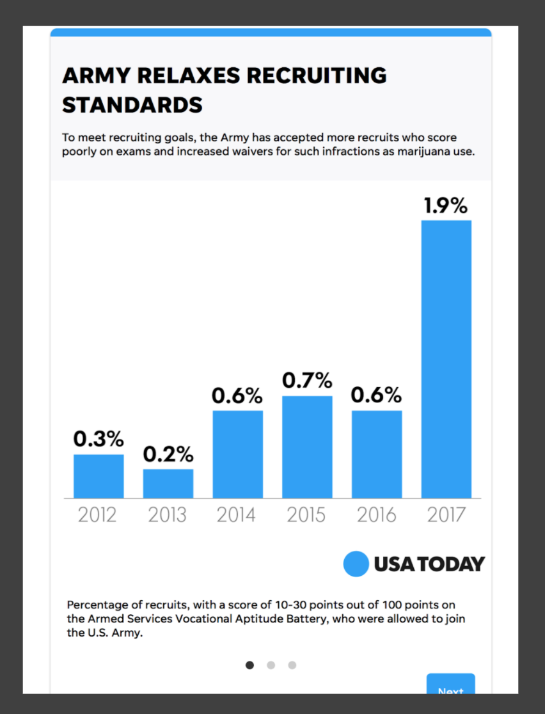
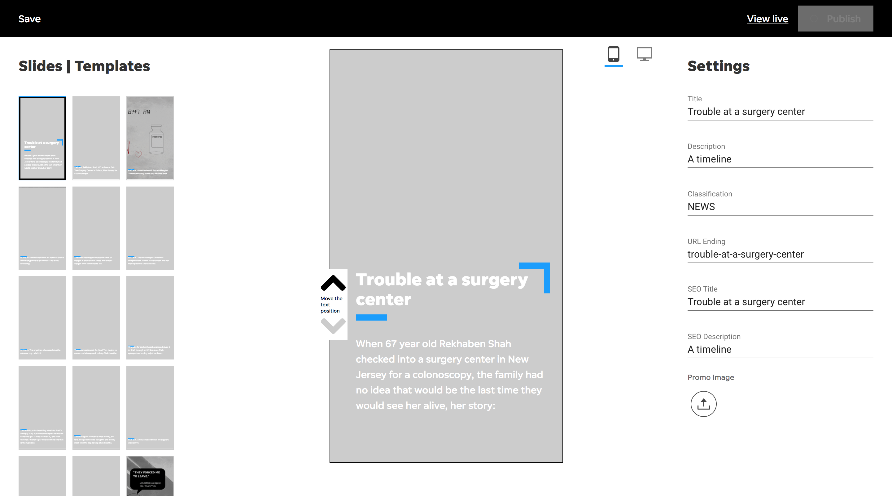

## How might we tell a better short story in an immersive digital experience?

- **Timeline**: 1 year
- **Goals**:  Design a high-impact visual storytelling format that's independent from traditional stories or galleries for the USA TODAY Network's newsrooms
- **Team**: Gannett | Storytelling Studio
- **Role**: UI & UX
- **Area of Focus**: Design to MVP

---

## How might we create a high-impact visual storytelling format that supports our journalism for the USA TODAY Network?

Explainers are a high-impact visual storytelling format that's independent from traditional stories or galleries. It's a standalone, web-based experience that works best with great visuals and short, punchy text.

- Goals: Provide a solution for the newsrooms to generate high-impact visual stories, enrich the reading experience, retention efforts by measuring recirculation and depth of engagement
- Team: Storytelling Studio, USA Today Journalists, USA Today Graphics
- Role: Product Designer, Design Prototyper – one of two designers.
- Areas of focus: visual design, prototyping, user testing, back-end visual cms authoring design

## Background

The goals were simple: we wanted to provide newsroom producers and editorial staff a tool that they could use to create a new storytelling experience. The interaction was similar to a slideshow, but we needed something that we could anchor to the USA Today brand and scale to over 100 newsrooms.

We also one of the ability to work with the social team making a more streamlined workflow between photojournalist and the social teams. Right now this consists of two separate workflows where information synthesis and sharing isn't as conducive and streamlined as it could've been.

We also knew that based on former data readers enjoyed short form contact that they can absorb. This was in the time and Instagram launched stories and before Snapchat's heyday.

Check out the ➔ [Competitive Analysis](https://docs.google.com/presentation/d/1SLhyRhvDPP7mruFVfnaTWSM6R6jVo5oouajxVRvkpaA/edit?usp=sharing "Google Slides competitive analysis") of common slideshow tools and card based tooling as preliminary research.

**Example of current newsroom slideshow presentation to convey information**

  

## Requirements & Constraints

This tool will be built outside of the current authoring platform
this tool will leverage the Universal Web framework on the display side
This tool is designed to be used with or without a designer
This tool is an MVP that will be iterated on over time

## The Process and Plan

Starting with templates (five)
Prototyping
Developing a user testing plan

## Demonstration

Check out the live link here: [Surgery Center Explainer](https://www.usatoday.com/explainer/surgerycenter/18/)

`video: https://www.youtube.com/embed/2Xc9gXyf2G4`

### The Making of Explainers

The MVP included templates that users could choose from from a bespoke internal builder. This mapped to their requirements and their editorial workflow. The template designs were created based on audience participation and to test out explainer length i.e. ten slides might not be better than five.
We spoke with four key stakeholders influential in the newsroom for MVP feedback.
We tracked iterations and prepared the MVP for progressive enhancement.

  

## Results & User Data Learnings

We interviewed several key stakeholders helping us mold and shape the future of the tool.

> I wish I could change the template after I choose it. Sometimes the image of words don’t display as intended in that template and I want to try something else. - Quote from internal user

> This may be over-complicating things, but it would be great if the text boxes that sit on top of a photo had an opacity slider. Some of the text got hard to read when a portion of the background was white-ish with white text on top. - Quote from internal user

I then set up a user testing session using usertesting.com.
It was designed for our MVP to decide what is the minimum amount of UI that will allow the content to be found and effectively communicate to the user? This addressed the UX principle of Occam’s Razor.

Eventually the qualitative feedback paired with the cost of maintenance for a waning platform, Explainers were sunset. The adoption and audience participation just weren't what was expected. They also weren't native to the CMS. Soon, AMP Stories were adopted by the content and editorial teams <https://www.ampproject.org/docs/design/visual_story>

### See examples here

- <https://www.usatoday.com/explainer/parkland-survivors-march-florida-capitol/19/>
- <https://www.usatoday.com/explainer/the-evoloution-of-barbie/27/>
- <https://www.usatoday.com/explainer/surgerycenter/18/>
- <https://www.usatoday.com/explainer/alis-most-famous-quotes/6/>

---

But, this wasn't a complete failure; because now we have an opportunity to create stories much like this one on [exposure.so](https://www.distastefulshroom.com/furloughed) but with our In-Depth framework.

See that case study here: [In-Depth](https://url.com)

---

Thanks for reading!
Get in touch 👉🏻 [joshua@jshmllr.com](mailto:joshua@jshmllr.com)
