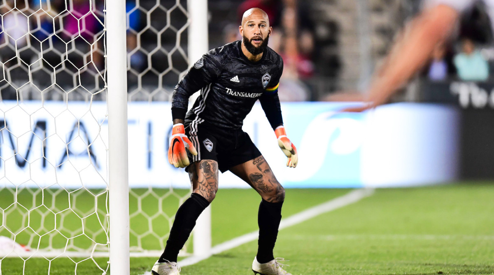

*You've seen and heard it before — "*gooooooooallll*!" *
## The true leader
Yes, if you've ever had the chance to watch a professional futbol game, it's easy to be drawn to the uproar of the crowd after a forward scores; but, let's take a look at the backfield for a moment or two. The man or woman standing in the back preventing those goals—perhaps not even a team captain—is arguably the team leader. Back in 2014, retired U.S. goalie Tim Howard gave it his all. [The team lost 2-1 against Belgium](https://fivethirtyeight.com/features/tim-howard-lost-but-he-just-had-the-best-match-of-the-world-cup/); yet, Tim gave the world the best game of the entire World Cup that year. Out of 18 shots, he conceded only two goals, making it historically one of the best games for a goalie ever. 

  

## Goals begin from the back of the field. 
it was without question growing up playing the game that goalies often received blame for opponents missing a block. That's just what kids do. However, we know looking at a game wholistically that negligence on behalf of the the entire team's responsibility is actually what causes goals to be scored. One who plays in the backfield, may get to relish in the sweet moments of a goal being scored but they're rarely celebrated for their stops—that is except the goalie. Goalies are the captains of defense as they command their team from the rear. They're able to accomplish this, because they can observe the lay of the entire field. In terms of business and life, this metaphor transfers rather accurately. Let’s dive more into this.

## Goalies possess the ability to command their team in such a way to both protect the net and prevent the ball from even coming near the goal. 
When the game is happening, the rhythm of the ball being maneuvered back and forth passed between players a good goalie possesses a watchful eye—ever vigilant—and is on her toes should the offense move onto her team's half of the field.

## Great goalies are decisive.
They know when it’s important to give their team a break and when to let the offensive team push forward a bit. But, defense is as much preventative as it is battling back. If you ever watch a professional match you’ll see how the defensive players along with the goalie will swing the ball from one side of the field to the other to try to create a different momentum. Then, when the time is right, the goalie and the whole team move forward together with the ball. Should they be lucky enough to score, you’ll be able to trace game film all the way back to when the goalie first touched the ball.

The defenders, halfbacks, and strikers who get a lot of the glory receive a lot of TV time and actual ball time.

We often tend to feel our work is tough, but we should see our teammates too.

As a teammate, strive for empathy
Put yourself in your teammates' shoes
Understand their perspective
Understand where they are coming from

---
Thanks for reading! 
Get in touch @ [joshua@jshmllr.com](mailto:joshua@jshmllr.com)

